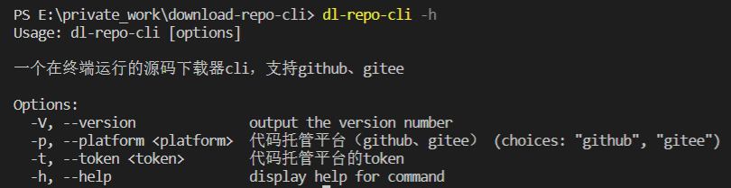
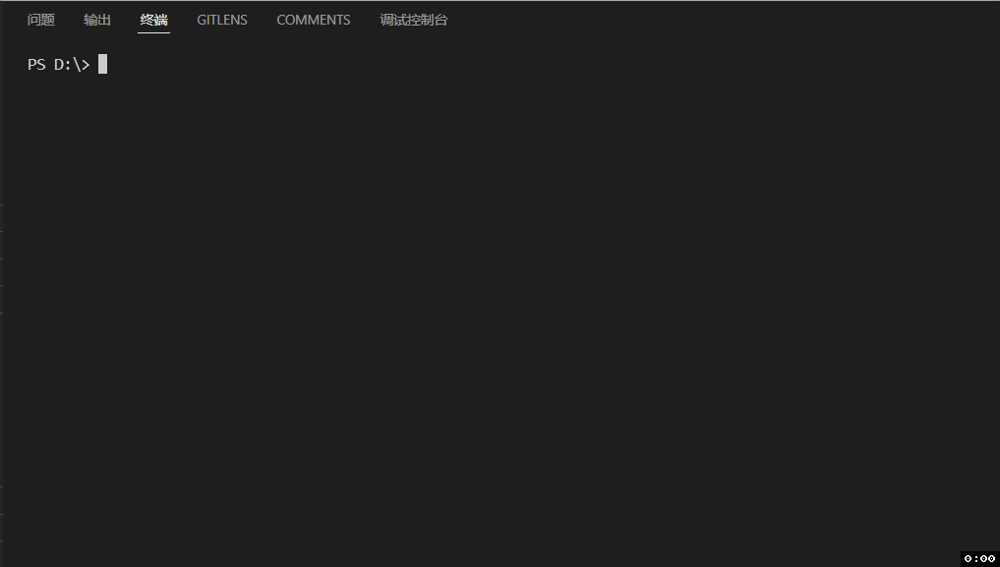

# dl-repo-cli
一个在终端运行的源码下载器cli，支持github、gitee

### 使用

```javascript
npm install dl-repo-cli -g
在命令行输入dl-repo-cli直接回车 下一步即可

可通过配置options手动配置platform和token的缓存配置
dl-repo-cli -p <github|gitee> -t <your token>
```
### 配置

<p align="center">
   
</p>

### 效果预览

<p align="center">
   
</p>